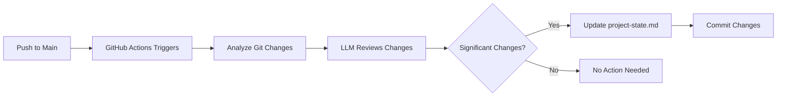

# Setup Guide: Automated Project State Updates

## Quick Start

This PR implements automated updates for `plan/project-state.md`. Here's how to activate it:

### 1. Add API Key Secret

Go to your repository Settings → Secrets and variables → Actions, then add:

- **Name**: `OPENAI_API_KEY`
- **Value**: Your OpenAI API key (starts with `sk-`)

### 2. Merge This PR

Once merged to main, the automation will activate automatically.

### 3. Test the System

After merging, make a small change and push to main. Check the Actions tab to see the workflow run.

## How It Works

## What Gets Updated

The system updates project-state.md when it detects:
- ✅ New features or architectural changes
- ✅ Database schema modifications
- ✅ New dependencies or tech stack changes
- ✅ Directory structure changes
- ✅ New API endpoints or routes
- ✅ Security or deployment changes

It **skips** updates for:
- ❌ Minor bug fixes
- ❌ Style/formatting changes
- ❌ Documentation-only changes
- ❌ Test updates

## Files Created

| File | Purpose |
|------|---------|
| `.github/workflows/update-project-state.yml` | Main GitHub Actions workflow |
| `.github/scripts/analyze-project-state.js` | LLM analysis script |
| `.github/scripts/github-copilot-analyzer.js` | Alternative implementation for future |
| `.github/scripts/README.md` | Detailed documentation |
| `plan/features/automated-project-state-updates-plan.md` | Feature plan |

## Alternative: GitHub Copilot Integration

The system includes a future-ready implementation for GitHub Copilot Chat API. When GitHub releases this capability for Actions, simply:

1. Replace OpenAI integration with GitHub Copilot
2. Remove OPENAI_API_KEY requirement
3. Use built-in GITHUB_TOKEN for authentication

## Monitoring

- **Success**: Check Actions tab for green checkmarks
- **Failures**: Review action logs for errors
- **Updates**: Look for commits with message "chore: auto-update project-state.md..."

## Troubleshooting

### No Updates Happening
- Check if OPENAI_API_KEY secret is set
- Verify recent changes meet update criteria
- Review Actions logs for errors

### Too Many Updates
- Adjust analysis criteria in the script
- Consider adding cooldown period between updates

### API Rate Limits
- Monitor OpenAI usage in your dashboard
- Consider upgrading API plan if needed

## Cost Considerations

- Typical analysis: ~1000-3000 tokens per run
- Estimated cost: $0.01-0.05 per analysis
- Runs only on main branch pushes
- Monthly cost typically under $5 for active repositories

## Support

For issues or questions:
1. Check the Actions logs first
2. Review `.github/scripts/README.md` for detailed docs
3. Open an issue with relevant log output

---

**Ready to activate?** Just add the OPENAI_API_KEY secret and merge this PR! 🚀