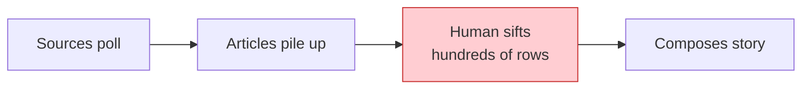
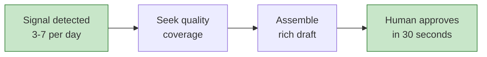
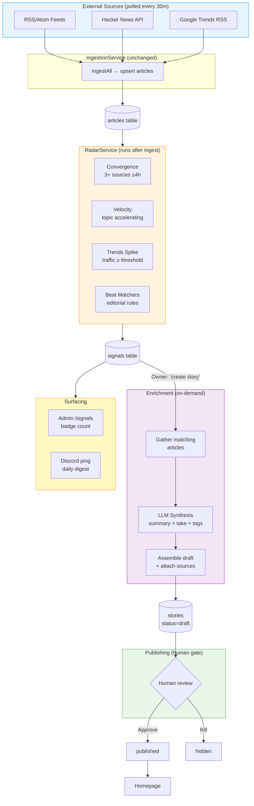
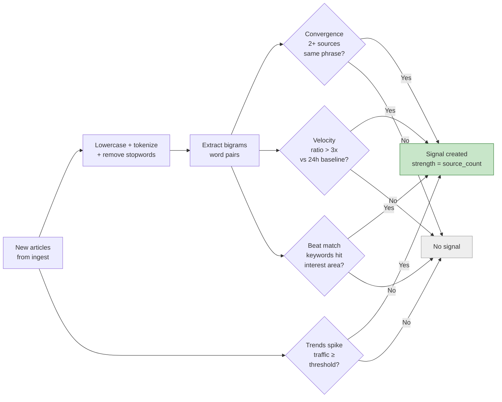
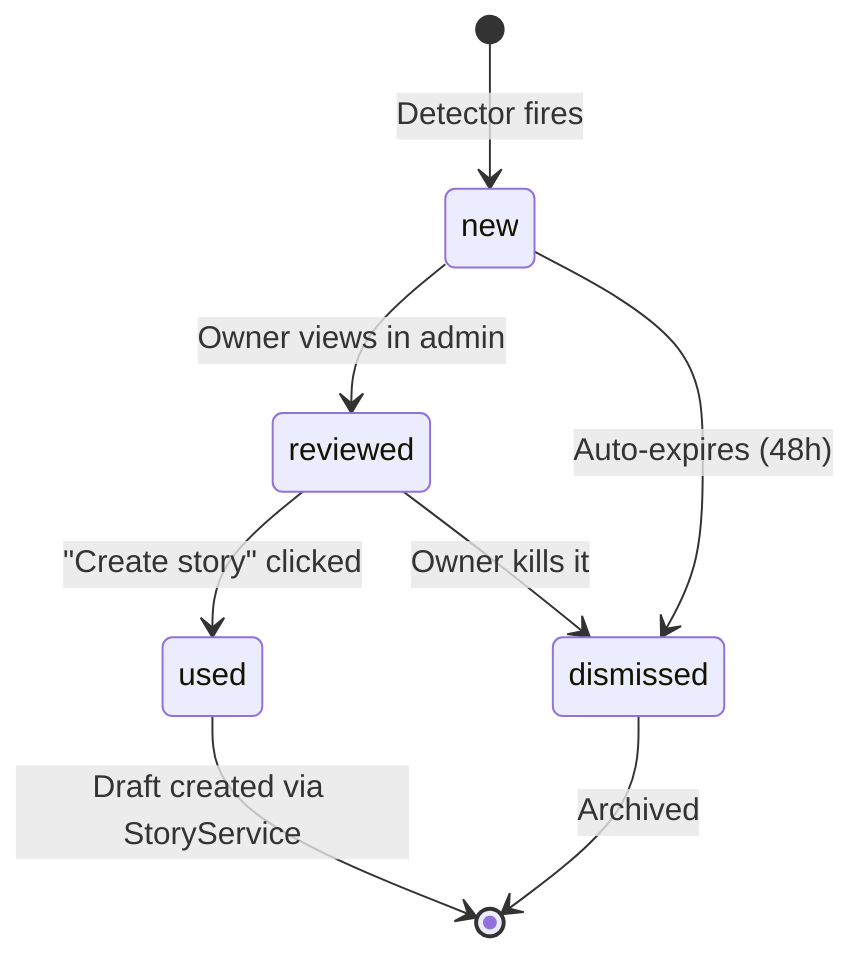
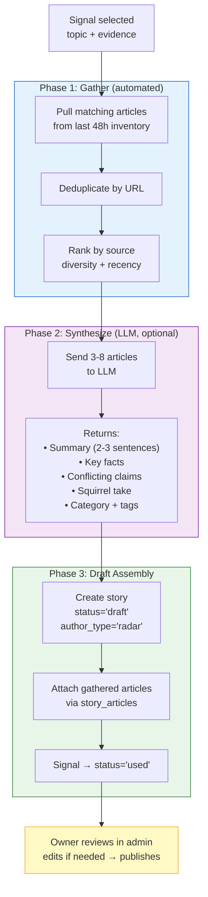
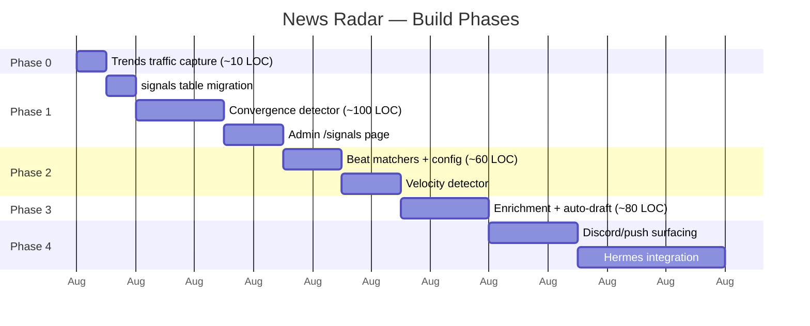

# News Radar — Signal-First Discovery Prototype

Status: **design / prototype**  
Created: 2026-07-26

---

## Problem

The current pipeline is passive accumulation:



Discovery is reactive — you're downstream of what RSS feeds serve. The human must sift hundreds of
raw articles to find the 3-5 worth publishing. This is the same burnout loop that killed the
original tsquirrel.

## Proposed Model: Signal → Hunt → Compose

Invert the flow. Detect **what's happening** first, then actively seek the best coverage.



This is how a real news editor works: "X is happening" → "find me the best coverage of X."

---

## Architecture



---

## Detectors (detail)

How the four detectors evaluate incoming articles:



### 1. Convergence Detector

**What:** When 2+ different sources publish articles containing the same phrase within a
sliding window, something is happening.

**How (no ML needed):**
1. Lowercase all article titles, strip non-alphanumeric chars
2. Tokenize into words, remove stopwords and words < 3 chars
3. Generate bigrams (consecutive word pairs) from each title
4. Group by bigram, count distinct `source_id` within the window
5. Threshold: 2+ sources = signal fires

Case-insensitive bigrams catch everything — proper nouns ("donald trump", "jack dorsey"),
lowercase topics ("social media", "open weight"), technical terms ("starship launch"),
and policy phrases ("trump tariffs"). No capitalization dependency.

**Validated against live data (487 articles, 5 days):** found 30 signals vs. only 6 with
the old capitalization regex. Top hit: "social media" across BBC, TechCrunch, and Google
Trends — a kids-and-social-media regulation story across France, Vietnam, and Italy that
the old approach completely missed.

**SQL sketch:**
```sql
WITH recent AS (
  SELECT id, source_id, lower(title) AS title
  FROM articles
  WHERE fetched_at > NOW() - INTERVAL '48 hours'
),
words AS (
  SELECT id, source_id,
         unnest(string_to_array(
           regexp_replace(title, '[^a-z0-9 ]', ' ', 'g'), ' '
         )) AS word,
         generate_subscripts(string_to_array(
           regexp_replace(title, '[^a-z0-9 ]', ' ', 'g'), ' '
         ), 1) AS pos
  FROM recent
),
clean AS (
  SELECT * FROM words
  WHERE length(word) >= 3
    AND word NOT IN ('the','and','for','are','but','not','you','all',
      'can','had','her','was','one','our','has','his','how','its',
      'new','now','say','she','too','use','says','said','been',
      'have','from','they','will','with','this','that','what',
      'when','your','more','some','than','them','into','just',
      'also','each','like','many','most','only','over','such',
      'about','after','being','could','every','first','found',
      'other','right','still','think','three','under','where',
      'which','while','would','years','before','during','should',
      'their','there','these','those','through','people',
      'news','says','report','watch','live','breaking','update')
),
bigrams AS (
  SELECT a.id, a.source_id,
         a.word || ' ' || b.word AS phrase
  FROM clean a
  JOIN clean b ON a.id = b.id AND b.pos = a.pos + 1
)
SELECT phrase,
       COUNT(DISTINCT source_id) AS sources,
       COUNT(DISTINCT id) AS articles
FROM bigrams
WHERE length(phrase) >= 7
GROUP BY phrase
HAVING COUNT(DISTINCT source_id) >= 2
ORDER BY sources DESC, articles DESC;
```

**Strength:** `source_count` × `article_count` — more sources AND more articles = stronger signal.

### 2. Velocity Detector

**What:** A topic that's accelerating (mentioned 4x in the last 2h vs 1x in the prior 22h) is
more interesting than one with steady coverage.

**How:**
- Compare article count for a topic in `last_2h` vs. `prior_22h`
- Ratio > 3x = velocity signal
- Works on the same bigram extraction as convergence

**Strength:** ratio × recent_count. A topic going 0→5 in 2h is stronger than 10→15.

### 3. Google Trends Spike

**What:** `ht:approx_traffic` field already in the Trends RSS feed. Currently we ingest the
articles but ignore the traffic number.

**How:**
- Parse `approx_traffic` during Trends ingestion (currently discarded)
- Store on the article or in a separate `trend_signals` table
- Threshold: configurable, likely `≥ 5000` for "worth noticing", `≥ 50000` for "definitely a story"

**Strength:** raw traffic number. Directly correlates to public interest.

### 4. Beat Matchers

**What:** Defined editorial interest areas with per-beat sensitivity.

**Configuration (JSON or DB rows):**
```json
[
  {
    "name": "AI & Machine Learning",
    "keywords": ["AI", "GPT", "LLM", "machine learning", "neural", "OpenAI", "Anthropic"],
    "sources": ["hackernews", "arstechnica", "techcrunch"],
    "threshold": { "sources": 2, "window_hours": 4 }
  },
  {
    "name": "Canadian Politics",
    "keywords": ["Trudeau", "Parliament", "Ottawa", "RCMP", "federal"],
    "sources": ["google-trends-ca", "bbc", "guardian"],
    "threshold": { "sources": 2, "window_hours": 6 }
  },
  {
    "name": "Science & Space",
    "keywords": ["NASA", "SpaceX", "CERN", "telescope", "discovery", "study finds"],
    "sources": ["arstechnica", "hackernews", "reuters"],
    "threshold": { "sources": 2, "window_hours": 8 }
  }
]
```

A beat "fires" when `threshold.sources` distinct sources publish articles matching its keywords
within `threshold.window_hours`.

**Strength:** number of keyword matches × source count.

---

## Schema (new table)

```sql
CREATE TABLE IF NOT EXISTS signals (
  id          SERIAL PRIMARY KEY,
  detector    VARCHAR(30) NOT NULL,       -- convergence | velocity | trends_spike | beat
  topic       TEXT NOT NULL,              -- extracted entity or beat name
  strength    INTEGER NOT NULL,           -- detector-specific score
  evidence    JSONB,                      -- { article_ids: [...], sources: [...], meta: {} }
  status      VARCHAR(20) DEFAULT 'new',  -- new | reviewed | used | dismissed
  fired_at    TIMESTAMP DEFAULT CURRENT_TIMESTAMP,
  expires_at  TIMESTAMP                   -- auto-dismiss if not acted on (e.g. +48h)
);

CREATE INDEX idx_signals_status ON signals(status, fired_at DESC);
CREATE INDEX idx_signals_topic ON signals(topic);
```

**Lifecycle:**



- `new` — just detected, visible in admin
- `reviewed` — owner looked at it
- `used` — a story draft was created from this signal
- `dismissed` — owner explicitly killed it, or it expired

Signals auto-expire after 48h (news is perishable).

---

## Enrichment Pipeline

When the owner (or Hermes, later) decides a signal is worth a story:



### Phase 1: Gather (automated, immediate)

1. Pull all articles from inventory matching the signal topic (title keyword match against
   `articles` from last 48h)
2. Deduplicate by URL
3. Rank by source diversity + recency

### Phase 2: Synthesize (LLM, optional)

Given 3-8 gathered articles, produce:
- **Summary:** 2-3 sentence neutral synthesis
- **Key facts:** bullet list of what's known
- **Conflicting claims:** if sources disagree, note it
- **Squirrel take:** editorial one-liner
- **Suggested category + tags**

### Phase 3: Draft Assembly

- Create story with `status='draft'`, `author_type='radar'`
- Attach gathered articles via `story_articles`
- Pre-fill summary, squirrel_take, category, tags from LLM (editable)
- Signal marked `status='used'`

**Owner reviews in admin → edits if needed → publishes.**

---

## Implementation Plan (phased)



### Phase 0: Trends traffic capture (trivial, unblocks phase 1)
- Parse `ht:approx_traffic` in `IngestionService.parseGoogleTrends()`
- Store as a field on the article row or a simple `trend_traffic` column
- ~10 lines of code change

### Phase 1: Convergence detector (SQL-only, no new deps)
- Entity extraction from titles (regex, not ML)
- Run as part of ingest cron (after articles upserted)
- Insert into `signals` table when threshold met
- Admin page: `/admin/signals` — list of active signals with evidence links
- **Estimated: ~100 LOC service + migration + 1 admin view**

### Phase 2: Beat matchers (config-driven)
- Beats defined in `server/config/beats.json` (or DB table if admin-editable)
- Checked on each ingest cycle against new articles
- Fires signal when beat criteria met
- **Estimated: ~60 LOC added to RadarService**

### Phase 3: Enrichment + auto-draft
- "Create story from signal" button in admin (or API call from Hermes)
- Gathers matching articles, optionally runs LLM synthesis
- Creates pre-filled draft
- **Estimated: ~80 LOC in StoryService + admin UI additions**

### Phase 4: Surfacing (Discord/push — future)
- Daily digest: "3 signals fired today, strongest: [topic] (5 sources)"
- One-tap links to admin review
- Hermes integration: agent evaluates signals, proposes which to enrich

---

## What This Replaces

| Before (current) | After (radar) |
|---|---|
| Scan hundreds of raw articles manually | Get 3-5 alerts per day, pre-triaged |
| "Is anything happening?" → dig through admin | "This is happening" → here's the evidence |
| Hope SummaryService clusters well | Explicit editorial criteria (beats) decide what matters |
| Same sensitivity for all topics | Per-beat thresholds tuned to your interests |
| Discovery requires being at the computer | Signals accumulate; review on your schedule |

---

## Anti-Patterns to Avoid

1. **Don't require checking the system for value.** Signals must come to you (dashboard badge,
   push, Discord). If you have to poll the admin panel, this fails the same way manual curation did.

2. **Don't over-detect.** 20 signals/day = noise. Target 3-7 meaningful signals. Tune thresholds
   up until signal quality is high. False negatives (missed stories) are less harmful than alert
   fatigue.

3. **Don't auto-publish from radar.** Radar surfaces candidates; a human (or reviewed agent)
   publishes. The "proud squirrels" principle still applies.

4. **Don't depend on paid APIs for detection.** Radar must work with zero marginal cost (it's
   just SQL over your existing article stream). LLM is optional enrichment, not required for
   detection.

---

## Relationship to Existing Architecture

```mermaid
flowchart LR
    subgraph Existing["Existing (unchanged)"]
        FS[IngestionService<br/>30m cron]
        SS[StoryService<br/>publish primitive]
        ADMIN[Admin UI<br/>stories + sources]
    end

    subgraph New["New"]
        RS[RadarService<br/>detectors]
        SIG[(signals table)]
        SIGUI[/admin/signals<br/>page]
    end

    subgraph Repurposed["Repurposed"]
        LLM[SummaryService<br/>on-demand enrichment]
    end

    FS -->|"runs after ingest"| RS
    RS --> SIG
    SIG --> SIGUI
    SIGUI -->|"create story"| SS
    SIGUI -->|"enrich"| LLM
    LLM --> SS

    style Existing fill:#e8f5e9,stroke:#4CAF50
    style New fill:#fff3e0,stroke:#FF9800
    style Repurposed fill:#e3f2fd,stroke:#1565c0
```

- **IngestionService:** unchanged. Still ingests articles on 30m cron. Radar runs *after* ingest.
- **SummaryService:** stays retired from cron. Its LLM synthesis becomes an optional enrichment
  step called on-demand per signal, not a batch process.
- **StoryService:** unchanged. Radar's output is a draft story created through the same
  `createDraft` + `attachSource` primitive the admin UI uses.
- **Admin UI:** gains a `/admin/signals` page. Signals link to "create story from this" action.
- **CronService:** adds a `radarScan` step after `ingestAll` completes.

New service: **`RadarService`** — runs detectors, writes to `signals` table. Stateless, idempotent
(re-running doesn't create duplicate signals for the same topic+window).

---

## Open Questions

- Should beats be DB-managed (admin editable) or file-based (`beats.json`)? File is simpler for
  v1; DB enables future user-defined beats if the platform ever supports multiple editors.
- Entity extraction quality: regex catches "Aroldis Chapman" and "Spider-Man" but misses
  "retirement planning" (lowercase). **Solved:** case-insensitive bigram approach catches both
  proper nouns and lowercase phrases. Validated on live data — 30 signals vs. 6 with old regex.
- Signal dedup: if convergence and a beat both fire for the same topic, merge into one signal or
  keep separate? Recommend merge (higher combined strength).
- Enrichment search APIs: Google News RSS (`news.google.com/rss/search?q=TOPIC`) is free and
  would expand coverage beyond your subscribed sources. Worth adding in Phase 3?
- **Multilingual:** v1 is English-only — the stopword list, bigram extraction, and
  `[^a-z0-9 ]` regex all assume Latin/English. Google Trends CA already ingests French articles
  (see "Hogares de Belén", Italian social media studies in live data). When `articles.lang` is
  added (see architecture.md language note), the radar needs: per-language stopword lists,
  Unicode-aware tokenization (`[^\p{L}\p{N} ]`), and either per-language bigram matching or
  cross-language entity normalization. Not blocking v1 — but the bigram approach is inherently
  language-dependent, so this isn't just a filter change.
